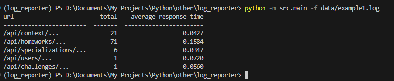
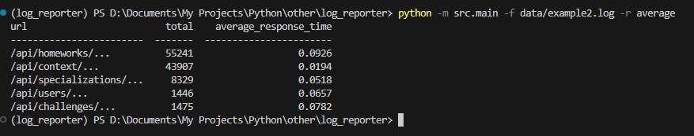
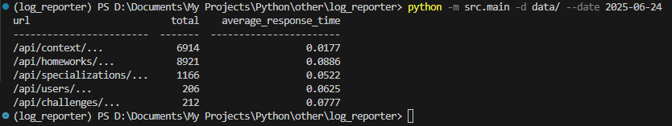

## Log Reporter
Тестовый проект для обработки лог-файлов.

## Примеры запуска:
- python -m src.main -f data/example1.log

- python -m src.main -f data/example2.log -r average

- python -m src.main -d data/ --date 2025-06-24

## Поддерживаемые опции:
- -f, --file: путь к одному или нескольким лог-файлам
- -d, --dir: путь к директории с логами
- --report: тип отчета
- --date: фильтрация записей по дате

### Если указана дата, будут обрабатываться только записи с совпадающей датой.

### Как добавить новый тип отчёта:

1) Создайте класс-отчёт, унаследованный от AbstractReporter.
2) Добавьте его в перечисление ReportEnum и в словарь внутри функции get_reporter_from_arg
